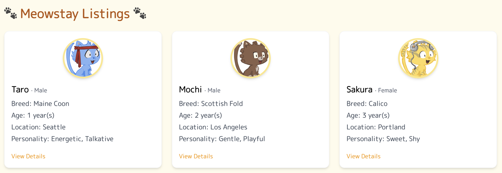

# 🏡🐈‍⬛ meowstay

Originally a take-home assignment built to parse XML property listings, this project has been reborn into something a little more purr-sonal: 🐾 meowstay 🐾, a cozy Rails app where adorable cats list their housing preferences and show off their best sides.

This version keeps the technical backbone of the original project, but with a refreshed theme, data model, and UI.

<p align="center"><i>A preview of the app: </i></p>



---

## 🖥️ Demo

Currently not deployed, but you can find screenshots in the `/public/screenshots` folder or view a sample above.

## 🛠️ Tech Stack

- Ruby 3.2.2
- Rails 7.1.5
- JSON-based data seeding
- Tailwind CSS (via CDN)

> 💡 Ruby version can be managed using tools like [rbenv](https://github.com/rbenv/rbenv) or [asdf](https://asdf-vm.com/) – use whichever you prefer as long as the version matches.

---

## 🚀 Getting Started

1. Install dependencies

```bash
$ bin/rails bundle install
```

2. Create database & run migration

```bash
$ bin/rails db:create
$ bin/rails db:migrate
```

3. Seed the database with mock listings

```bash
$ rails db:seed
```

4. Start the rails server

```bash
$ bin/rails server
```

Open http://localhost:3000 to view it in the browser.

## ⚙️ Features

- Listings of cat profiles with breed, age, personality, and roommate preferences
- Individual detail view for each cat ("kitty profile")
- Simple responsive layout with Tailwind grid and card styling

Each card includes a generated cat avatar (via RoboHash, using the set4 = cats variant) and links to a more detailed view.

## 📦 From XML to JSON

The original version of this project used `Nokogiri` to parse an XML property feed and import relevant data. While that code is no longer active in the live app, it remains available under `/services` for reference.

This version replaces XML parsing with a handcrafted JSON mock file, located at `lib/assets/data/meowstay_listings.json`. A small JsonImporter service is used to read the file and create records on seeding.

## 🌟 Bonus: Personal Takeaways

I used this project as a chance to brush up on Rails conventions and refresh my UI composition with Tailwind. This was actually my first time using Tailwind CSS, and I really enjoyed how intuitive and composable it felt!

It was fun reimagining a dry data feed into a kitty listing board with personality.

> P.S. If you're wondering: yes, I may have given each mock kitty their own backstory. No regrets.
